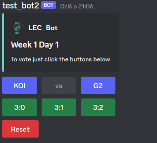

# LEC BOT 🤖
This is a discord bot which provides voting system to LEC matches (also Worlds and MSI)

## Features 

Bot sends voting message every match day and also has some commands:
#### *Common:*
- `points`(h) -> check server users' points
- `feedback`(s) -> command to give feedback for bot oweners
- `my_vote`(s) -> command to see your's today vote

#### Help

- `help_vote`(h) -> command to discover how to vote
- `help`(h) -> shows help message
- `bonus_help`(h) -> command to discover how to vote for bonus

#### Bonuses:

- `bonus`(h) -> command with your answer(s) to vote
- `bonus_reset`(h) -> command to reset your bonus vote
- `bonus_available`(h) -> command to see today bonus available answer(s)

#### Admin
>Those commands are for servers' moderators
- `role_to_ping`(h) -> command to set role to ping in every new voting message
- `disable_role_to_ping`(h) -> command to disable role to ping in every new voting message
- `set_channel`(h) -> command to set channel where new voting message wiil be send
- `bonus_change_state`(h) -> command to turn 'off' or turn on bonus 'on' server (use with off or on parameter)
>(h) next to command means its hybrid command (works with '/' and bot prefix '>')

>(s) next to command means its `app_command` (works only with '/')
